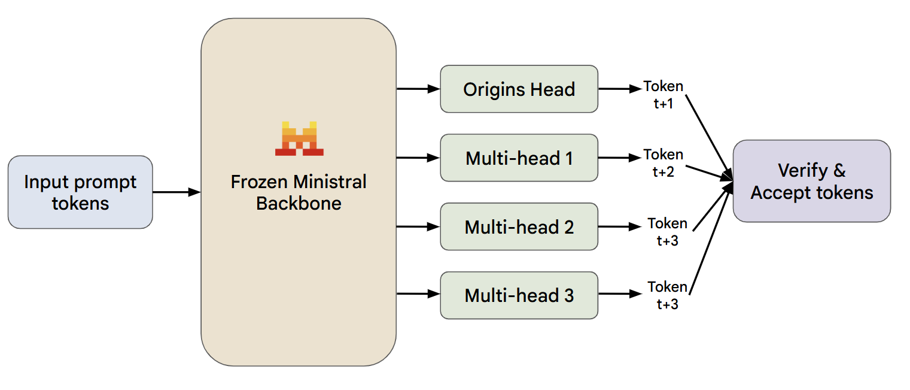

# Ministral Multi-Token Heads (For Hackathon by Mistral AI)

This repo trains `mistralai/Ministral-3-3B-Instruct-2512` with extra future-token heads and benchmarks inference speed against normal greedy decoding.

**Note: We ran all our experiments on a 3090 runpod instance, please use the same to replicate our results.**

<p align="center">
  
</p>


## What This Implements
- LoRA fine-tuning on Hugging Face `mbpp` code tasks (`use_4bit=false` by default).
- Optional QLoRA path when `use_4bit=true` and checkpoint compatibility allows 4-bit loading.
- Multi-token loss:
  - Head 0: next token (`+1`).
  - Extra heads: future tokens (`+2`, `+3`, ...).
- W&B logging:
  - Total loss, per-head losses, eval loss, lr, tokens/sec, GPU memory.
- Benchmark script:
  - Baseline: standard greedy `generate()`.
  - Multi-head: draft + verify decoding with acceptance-rate stats.

## 1) Setup
```bash
pip install -r requirements.txt
```

Copy `.env.example` to `.env` and set:
- `HF_TOKEN` (required; must have access to the model)
- `WANDB_API_KEY` (required if W&B logging enabled)

## 2) Train
```bash
python -m src.train --config configs/default.yaml
```

Optional overrides:
```bash
python -m src.train --config configs/default.yaml --output_dir outputs/my_run --max_steps 800
```

Resume from the latest saved checkpoint:
```bash
python -m src.train --config configs/default.yaml --output_dir outputs/my_run --resume_from_checkpoint latest
```
If the latest checkpoint is corrupted (e.g., interrupted write), the script will auto-skip it and use the latest readable checkpoint.

Print model trainable-weight fractions only (no training):
```bash
python -m src.train --config configs/default.yaml --print_param_stats_only
```
This writes `training_param_stats.json` in `output_dir` with total/trainable/frozen counts and LoRA vs aux-head breakdown.

Training artifacts saved in `output_dir`:
- `checkpoint-*/` (Trainer checkpoints for resume)
- `adapter/` (LoRA adapter)
- `multi_token_heads.pt` (extra head weights)
- `multitoken_config.json`
- tokenizer files
- `final_eval_metrics.json`

## 3) Benchmark Inference
```bash
python -m src.infer_benchmark --model_dir outputs/mt_3b_demo --num_prompts 30 --warmup_prompts 3 --repeats 3 --max_new_tokens 128 --fixed_length
```

If training is interrupted and you only have a `checkpoint-*` folder:
```bash
python -m src.infer_benchmark --checkpoint_dir outputs/mt_3b_demo/checkpoint-400 --config configs/default.yaml --num_prompts 30 --warmup_prompts 3 --repeats 3 --max_new_tokens 128 --fixed_length
```

Use realistic EOS stopping instead of fixed-length timing:
```bash
python -m src.infer_benchmark --model_dir outputs/mt_3b_demo --num_prompts 30 --warmup_prompts 3 --repeats 3 --max_new_tokens 128 --eos_aware
```

Run only adapted baseline vs multi-token (skip raw base model):
```bash
python -m src.infer_benchmark --model_dir outputs/mt_3b_demo --no_include_raw_base
```

Outputs:
- Console table per repeat + aggregate medians.
- `benchmark_results.json` in run output dir.
- Includes `token_acceptance_rate` for both modes (baseline is `1.0` by definition, multi-token is accepted drafted tokens / drafted tokens).
- 3-way comparison by default:
  - `raw_base` (original model AR)
  - `adapted_baseline` (LoRA model AR)
  - `multi_token` (LoRA model + multi-token decode)

Optional: generate a side-by-side GIF for one prompt:
```bash
python -m src.make_speed_gif --model_dir outputs/mt_3b_demo --max_new_tokens 128 --fixed_length --fps 10
```
This saves `outputs/mt_3b_demo/speed_side_by_side.gif`.
You can provide your own input with either:
- `--question "..."` (wrapped in a neutral instruction template, non-code by default)
- `--prompt "..."` (full prompt text as-is)
- `--question "..." --code_template` (old code-generation wrapper behavior)
```bash
python -m src.make_speed_gif --model_dir outputs/mt_3b_demo --max_new_tokens 128 --fixed_length --fps 10 --question "Explain in simple terms why regular exercise helps mental health."
```

## 4) Run Quality Benchmarks (lm-eval Harness)
Quick 4-task benchmark (raw base vs adapted LoRA vs multi-token):
```bash
python -m src.lm_eval_benchmark --model_dir outputs/mt_3b_demo
```

By default this runs:
- `arc_easy`
- `hellaswag`
- `piqa`

and uses a quick limit (`--limit 100`) for faster hackathon iteration.

Fuller run (no limit):
```bash
python -m src.lm_eval_benchmark --model_dir outputs/mt_3b_demo --limit 0
```

Custom task list:
```bash
python -m src.lm_eval_benchmark --model_dir outputs/mt_3b_demo --tasks arc_easy,piqa,winogrande,hellaswag
```

If you include code-exec tasks (for example `mbpp` / `humaneval`), add:
```bash
python -m src.lm_eval_benchmark --model_dir outputs/mt_3b_demo --tasks mbpp,humaneval --confirm_run_unsafe_code
```

Artifacts written to `outputs/mt_3b_demo/lm_eval/`:
- `lm_eval_summary.json` (full merged result, commands, per-task comparison)
- `lm_eval_comparison.md` (table for slides/judging)
- For Ministral/Mistral3, the script uses lm-eval's `hf-mistral3` backend (PR #3487) when available, and auto-falls back to the older `hf` loading path if needed.
- `multi_token` is included by default in the report. In lm-eval this is head-0 AR quality (same decoding mode as adapted LoRA). To force a separate multi-token pass instead of reusing adapted results:
```bash
python -m src.lm_eval_benchmark --model_dir outputs/mt_3b_demo --force_multi_token_run
```

## Notes
- Default config is tuned for a single 24GB GPU with gradient accumulation.
- `Ministral-3-3B-Instruct-2512` may expose native FP8 quantization metadata; this code auto-disables 4-bit bitsandbytes loading for compatibility.
- Checkpointing defaults: `save_steps=100`, `save_total_limit=3`.
- Benchmark defaults: `warmup_prompts=3`, `repeats=3`, `fixed_length=true`, `include_raw_base=true`.
